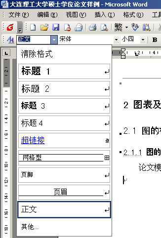

<!-- 使用多种标题格式 -->
<!-- markdownlint-disable MD003 -->
<!-- 使用多个一级标题 -->
<!-- markdownlint-disable MD025 -->

中文题目 <!-- omit in toc -->
===

Foreign language title <!-- omit in toc -->
---

| 项目       | 信息               |
| ---------- | ------------------ |
| 学部（院） | 电子信息与电子工程 |
| 专业       | 计算机科学与艺术   |
| 学生姓名   | 纯字节             |
| 学号       | 2022000666         |
| 指导教师   | 莱斯丽             |
| 完成日期   | 2072年1月31日      |

| 项目     | 信息         |
| -------- | ------------ |
| author   | Tom          |
| 工作单位 | 无限加班公司 |

目录 <!-- omit in toc -->
===

Template: 论文翻译不生成目录，此处为方便 Markdown 查看使用

- [摘要](#摘要)
- [1 正文格式](#1-正文格式)
  - [1.1 特殊处理内容](#11-特殊处理内容)
- [2 标题示例](#2-标题示例)

原文 <!-- omit in toc -->
===

不在 Word 中插入原文，本模块作为打印原文提醒。

摘要
===

原文中如果无摘要，此内容不写，本模块整个删掉即可

关键词：

- 翻译
- 高级
- 赛高

正文 <!-- omit in toc -->
===

# 1 正文格式

正文格式参考论文模板。

## 1.1 特殊处理内容

此处为简单正文示例。

1. 引用

   图、表、公式请直接按照译文中的格式写入，
   文献引用会根据情况处理为上角标[5,7]或句子成分文献[3-4]，但不会替换方括号内内容。

2. 图、表、公式

   对于插入的图、表、公式，正常插入即可，将保留样式以外的部分作为标题，不进行索引处理。
   下面示例中图标题被解析为 "图别名:图名"，需要空格请使用 &nbsp;。

   

   对于不插入的图、表、公式，使用空图片格式表示。
   路径或内容留空即可，图片样式信息将被忽略。
   如：

   
   
   

3. 空格

   如果需要插入额外的空格，可以使用&nbsp;进行插入。
   与中文和中文标点相同，at &nbsp; 的前后不会保留空格。

# 2 标题示例

一些内容。

<!-- 不翻译致谢和参考文献，需保留以下内容 -->

致谢：致谢已略(见原文)

参考文献：参考文献已略(见原文)
