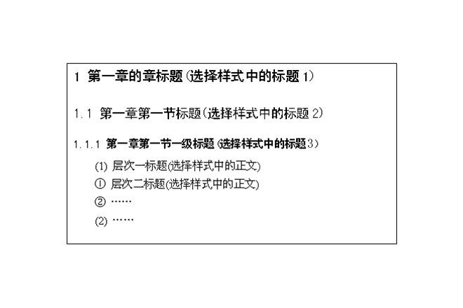

<!-- 使用多种标题格式 -->
<!-- markdownlint-disable MD003 -->
<!-- 使用多个一级标题 -->
<!-- markdownlint-disable MD025 -->

大连理工大学本科毕业设计（论文）题目 <!-- omit in toc -->
===

The Subject of Undergraduate Graduation Project (Thesis) of DUT <!-- omit in toc -->
---

| 项目       | 信息 |
| ---------- | ---- |
| 学院（系） |      |
| 专业       |      |
| 学生姓名   |      |
| 学号       |      |
| 指导教师   |      |
| 评阅教师   |      |
| 完成日期   |      |

摘要
===

“摘要”是摘要部分的标题，不可省略。

标题“摘要”选用模板中的样式所定义的“标题1”，再居中；或者手动设置成字体：黑体，居中，字号：小三，1.5倍行距，段后11磅，段前为0。

摘要是毕业设计（论文）的缩影，文字要简练、明确。内容要包括目的、方法、结果和结论。单位采用国际标准计量单位制，除特别情况外，数字一律用阿拉伯数码。文中不允许出现插图。重要的表格可以写入。

摘要正文选用模板中的样式所定义的“正文”，每段落首行缩进2个汉字；或者手动设置成每段落首行缩进2个汉字，字体：宋体，字号：小四，行距：多倍行距 1.25，间距：段前、段后均为0行，取消网格对齐选项。

摘要篇幅以一页为限，字数限500字以内。

摘要正文后，列出3-5个关键词。“关键词：”是关键词部分的引导，不可省略。关键词请尽量用《汉语主题词表》等词表提供的规范词。

关键词与摘要之间空一行。关键词词间用分号间隔，末尾不加标点，3-5个；黑体，小四，加粗。关键词整体字数限制在一行。

关键词：

- 写作规范
- 排版格式
- 毕业设计（论文）

Abstract
===

外文摘要要求用英文书写，内容应与“中文摘要”对应。使用第三人称，最好采用现在时态编写。

“Abstract”不可省略。标题“Abstract”选用模板中的样式所定义的“标题1”，再居中；或者手动设置成字体：Times New Roman，居中，字号：小三，多倍行距1.5倍行距，段后11磅，段前为0行。

标题“Abstract”上方是论文的英文题目，字体：Times New Roman，居中，字号：小三，行距：多倍行距 1.25，间距：段前、段后均为0行，取消网格对齐选项。

Abstract正文选用设置成每段落首行缩进2字，字体：Times New Roman，字号：小四，行距：多倍行距 1.25，间距：段前、段后均为0行，取消网格对齐选项。

Key words与摘要正文之间空一行。Key words与中文“关键词”一致。词间用分号间隔，末尾不加标点，3-5个；Times New Roman，小四，加粗。

Key Words:

- Write Criterion
- Typeset Format
- Graduation Project (Thesis)

目录
===

目录不会按照这里的目录生成，此处目录仅供 Markdown 使用。

- [摘要](#摘要)
- [Abstract](#abstract)
- [目录](#目录)
- [引言](#引言)
- [1  正文格式说明](#1--正文格式说明)
  - [1.1  论文格式基本要求](#11--论文格式基本要求)
  - [1.2  论文页眉页脚的编排](#12--论文页眉页脚的编排)
  - [1.3  论文正文格式](#13--论文正文格式)
  - [1.4  章节标题格式](#14--章节标题格式)
  - [1.5  各章之间的分隔符设置](#15--各章之间的分隔符设置)
  - [1.6  正文中的编号](#16--正文中的编号)
- [2  图表及公式的格式说明](#2--图表及公式的格式说明)
  - [2.1  图的格式说明](#21--图的格式说明)
    - [2.1.1  图的格式示例](#211--图的格式示例)
    - [2.1.2  图的格式描述](#212--图的格式描述)
  - [2.2  表的格式说明](#22--表的格式说明)
    - [2.2.1  表的格式示例](#221--表的格式示例)
    - [2.2.2  表的格式描述](#222--表的格式描述)
  - [2.3  公式的格式说明](#23--公式的格式说明)
    - [2.3.1  公式的格式示例](#231--公式的格式示例)
    - [2.3.2  公式的格式描述](#232--公式的格式描述)
  - [2.4  参考文献的格式说明](#24--参考文献的格式说明)
    - [2.4.1  参考文献在正文中引用的示例](#241--参考文献在正文中引用的示例)
    - [2.4.2  参考文献在正文中引用的书写格式](#242--参考文献在正文中引用的书写格式)
    - [2.4.3  参考文献的书写格式](#243--参考文献的书写格式)
    - [2.4.4  参考文献的书写格式示例](#244--参考文献的书写格式示例)
  - [2.5  量和单位的使用](#25--量和单位的使用)
    - [2.5.1  使用方法](#251--使用方法)
    - [2.5.2  中华人民共和国法定计量单位](#252--中华人民共和国法定计量单位)
  - [2.6  规范表达注意事项](#26--规范表达注意事项)
    - [2.6.1  名词术语](#261--名词术语)
    - [2.6.2  数字](#262--数字)
    - [2.6.3  外文字母](#263--外文字母)
    - [2.6.4  量和单位](#264--量和单位)
    - [2.6.5  标点符号](#265--标点符号)
- [3 打印说明](#3-打印说明)
  - [3.1  封面](#31--封面)
  - [3.2  原创性声明](#32--原创性声明)
  - [3.3  关于使用授权的声明](#33--关于使用授权的声明)
  - [3.4  中英文摘要](#34--中英文摘要)
  - [3.5  目录](#35--目录)
  - [3.6  正文](#36--正文)
- [4  论文装订注意事项](#4--论文装订注意事项)
- [4.1  设计说明书（论文）](#41--设计说明书论文)
  - [4.2  外文翻译](#42--外文翻译)
  - [4.3  装订规范要求](#43--装订规范要求)
- [5  第五章题目（黑体，小三，1.5倍行距，段后1行）](#5--第五章题目黑体小三15倍行距段后1行)
  - [5.1  第一节题目（黑体，四号，1.5倍行距，段前0.5行）](#51--第一节题目黑体四号15倍行距段前05行)
    - [5.1.1  第一节一级题目（黑体，小四，1.5倍行距，段前0.5行）](#511--第一节一级题目黑体小四15倍行距段前05行)
  - [5.2  第二节题目](#52--第二节题目)
    - [5.2.1  第二节一级题目](#521--第二节一级题目)
- [结论](#结论)
- [参考文献](#参考文献)
- [附录 A  附录内容名称](#附录-a--附录内容名称)
- [修改记录](#修改记录)
- [致谢](#致谢)

引言
===

理工文科所有专业本科生的毕业设计（论文）都应有“引言”的内容。如果引言部分省略，该部分内容在正文中单独成章，标题改为文献综述，用足够的文字叙述。从引言开始，是正文的起始页，页码从1开始顺序编排。

针对做毕业设计：说明毕业设计的方案理解，阐述设计方法和设计依据，讨论对设计重点的理解和解决思路。

针对做毕业论文：说明论文的主题和选题的范围；对本论文研究主要范围内已有文献的评述；说明本论文所要解决的问题。建议与相关历史回顾、前人工作的文献评论、理论分析等相结合。

注意：是否如实引用前人结果反映的是学术道德问题，应明确写出同行相近的和已取得的成果，避免抄袭之嫌。注意不要与摘要内容雷同。

书写格式说明：

标题“引言”选用模板中的样式所定义的“引言”；或者手动设置成字体：黑体，居中，字号：小三，1.5倍行距，段后1行，段前为0行。

引言的字数在3000字左右（毕业设计类引言可适当调整为800字左右）。引言正文选用模板中的样式所定义的“正文”，每段落首行缩进2字；或者手动设置成每段落首行缩进2字，宋体，小四，多倍行距 1.25，段前、段后均为0行，取消网格对齐选项。

正文 <!-- omit in toc -->
===

# 1  正文格式说明

正文是毕业设计（论文）的主体，是毕业论文或工程设计说明书的核心部分。要求学生运用所学的数学、自然科学、工程基础和专业知识解决复杂问题的能力，能够针对问题设计解决方案，在设计环节中体现创新意识，并考虑社会、健康、安全、法律、文化、环境以及社会可持续发展等因素；要着重反映毕业设计或论文的工作，要突出毕业设计的设计过程、设计依据及解决问题的方法；毕业论文重点要突出研究的新见解，例如新思想、新观点、新规律、新研究方法以及新结果等。

正文 (含引言或文献综述部分)内容应包括以下方面：

本研究内容的总体方案设计与选择论证;

本研究内容硬件与软件的设计计算，实验装置与测试方法等;

本研究内容试验方案设计的可行性、有效性、技术经济分析等，试验数据结果的处理与分析论证以及理论计算结果的分析与展望等;

本研究内容的理论分析。对本研究内容及成果应进行较全面、客观的理论阐述，应着重指出本研究内容中的创新、改进与实际应用。理论分析中，应将他人研究成果单独书写并注明出处，不得将其与本人提出的理论分析混淆在一起。对于将其他领域的理论、结果引用到本研究领域者，应说明该理论的出处，并论述引用的可行性与有效性。

自然科学的论文应推理正确，结论清晰，无科学性错误。

管理和人文学科的论文应包括对研究问题的论述和系统分析，比较研究，模型或方案设计，案例论证或实证分析，模型运行的结果或建议，改进措施等。

正文要求论点正确，推理严谨，数据可靠，文字精练，条理分明，文字图表规范、清晰和整齐，在论文的行文上，要注意语句通顺，达到科技论文所必须具备的“正确、准确、明确”的要求。计算单位采用国务院颁布的《统一公制计量单位中文名称方案》中规定和名称。各类单位、符号必须在论文中统一使用，外文字母必须注意大小写，正斜体。简化字采用正式公布过的，不能自造和误写。利用别人研究成果必须附加说明。引用前人材料必须引证原著文字。在论文的行文上，要注意语句通顺，达到科技论文所必须具备的“正确、准确、明确”的要求。

## 1.1  论文格式基本要求

论文格式基本要求：

1. 纸  型：A4纸。
2. 打印要求：双面打印（除封面、任务书、原创性声明、关于使用授权的声明、中英文摘要等单面打印外，其余部分要求双面打印）。
3. 页边距：上3.5cm，下2.5cm，左2.5cm、右2.5cm。
4. 页  眉：2.5cm，页脚：2cm，左侧装订。
5. 字  体：正文全部宋体、小四。
6. 行  距：多倍行距：1.25，段前、段后均为0，取消网格对齐选项。

## 1.2  论文页眉页脚的编排

一律用阿拉伯数字连续编页码。页码应由正文首页开始，作为第1页。封面不编入页码。将摘要、Abstract、目录等前置部分单独编排页码。页码必须标注在每页页脚底部居中位置，宋体，小五。

页眉，宋体，五号，居中。填写内容是“毕业设计（论文）中文题目”。

模板中已经将字体和字号要求自动设置为缺省值，只需双击页面中页眉位置，按要求将填写内容替换即可。

## 1.3  论文正文格式

正文选用模板中的样式所定义的“正文”，每段落首行缩进2字；或者手动设置成每段落首行缩进2字，字体：宋体，字号：小四，行距：多倍行距 1.25，间距：段前、段后均为0行，取消网格对齐选项。

模板中已经自动设置为缺省值。

模板中的正文内容不具备自动调整格式的能力，如果要粘贴，请先粘贴在记事本编辑器中，再从记事本中拷贝，然后粘贴到正文中即可。或者使用手动设置，将粘贴内容的格式设置成要求的格式。

## 1.4  章节标题格式

1. 每章的章标题选用模板中的样式所定义的“标题1”，居左；或者手动设置成字体：黑体，居左，字号：小三，1.5倍行距，段后11磅，段前为0。每章另起一页。章序号为阿拉伯数字。在输入章标题之后，按回车键，即可直接输入每章正文。
2. 每节的节标题选用模板中的样式所定义的“标题2”，居左；或者手动设置成字体：黑体，居左，字号：四号，1.5倍行距，段后为0，段前0.5行。
3. 节中的一级标题选用模板中的样式所定义的“标题3”，居左；或者手动设置成字体：黑体，居左，字号：小四，1.5倍行距，段后为0，段前0.5行。

正文各级标题编号的示例如图1.1所示。



## 1.5  各章之间的分隔符设置

各章之间应重新分页，使用“分页符”进行分隔。

设置方法：在“插入”菜单中选择“分隔符(B)…”，在弹出的窗口中选择分隔符类型为“分页符”，确定即可另起一页。

## 1.6  正文中的编号

正文中的图、表、附注、公式一律采用阿拉伯数字分章编号。

如图1.2，表2.3，附注4.5，式6.7等。如“图1.2”就是指本论文第1章的第2个图。文中参考文献采用阿拉伯数字根据全文统一编号，如文献[3]，文献[3,4]，文献[6-10]等，在正文中引用时用右上角标标出。附录中的图、表、附注、参考文献、公式另行编号，如图A1，表B2，附注B3，或文献[A3]。

# 2  图表及公式的格式说明

## 2.1  图的格式说明

### 2.1.1  图的格式示例

图在正文中的格式示例如图2.1所示。


表、图序号后面，同样适当留空（汉字状态敲两次空格键）。

图2.1显示了论文模板中所定义的样式选择方法。使用鼠标选择相应的样式，对应的文字格式就发生相应改变。

### 2.1.2  图的格式描述

1. 图的绘制方法
   1. 插图、照片应尽量通过扫描粘贴进本文。
   2. 简单文字图可用WORD直接绘制，复杂的图考虑使用相应的图形绘制软件完成，提高图形表达质量。
2. 图的位置
   1. 图居中排列。
   2. 图与上文之间应留一空行。
   3. 图中若有附注，一律用阿拉伯数字和右半圆括号按顺序编排，如注1），附注写在图的下方。
3. 图的版式
   1. “设置图片格式”的“版式”为“上下型”或“嵌入型”，不得“浮于文字之上”。
   2. 图的大小尽量以一页的页面为限，不要超限，一旦超限要加续图。
4. 图名的写法
   1. 图名居中并位于图下，编号应分章编号，如图2.1。
   2. 图名与下文留一空行。
   3. 图及其名称要放在同一页中，不能跨接两页。
   4. 图内文字清晰、美观。
   5. 图名设置为宋体，五号，居中。

## 2.2  表的格式说明

### 2.2.1  表的格式示例

表在正文中的常用格式如表2.1至表2.3所示，请参考使用。

物流的概念和范围如表2.1表述。

表、图序号与后面文字同样应当适当留空（两次空格键）。

表2.1  物流的概念和范围

| 本质       | 过程                                                 |
| ---------- | ---------------------------------------------------- |
| 途径或方法 | 规划、实施、控制                                     |
| 目标       | 效率、成本效益                                       |
| 活动或作业 | 流动与储存                                           |
| 处理对象   | 原材料、在制品、产成品、相关信息                     |
| 范围       | 从原点（供应商）到终点（最终顾客）                   |
| 目的或目标 | 适应顾客的需求（产品、功能、数量、质量、时间、价格） |

美国广义物流后（勤）协会给出的定义如下：“为了符合顾客的要求，从原点到消费点对原材料、在制品、产成品与相关信息的流动和储存的效率成本效益进行规划、实施和控制的过程”。由此可见，物流不是作为一种具体技术和方法来研究的，而是一个过程或管理。

表2.2  统计表

| 产品   | 产量  | 销量  | 产值 | 比重 |
| ------ | ----- | ----- | ---- | ---- |
| 手机   | 11000 | 10000 | 500  | 50%  |
| 电视机 | 5500  | 5000  | 220  | 22%  |
| 计算机 | 1100  | 1000  | 280  | 28%  |
| ------ | ----- | ----- | ---- | ---- |
| 合计   | 17600 | 16000 | 1000 | 100% |

表2.3  分栏表

| 年度 | 产品   | 产量  | 销量  | 产值 |
| ---- | ------ | ----- | ----- | ---- |
| 2004 | 手机   | 11000 | 10000 | 500  |
|      | 计算机 | 1100  | 1000  | 280  |
| ---- | ------ | ----- | ----- | ---- |
| 2005 | 手机   | 16000 | 13000 | 550  |
|      | 计算机 | 2100  | 1500  | 320  |

从表2.2和表2.3可以看出，公司销售情况……。

### 2.2.2  表的格式描述

1. 表的绘制方法  
   表要用WORD绘制，不要粘贴。
2. 表的位置
   1. 表格居中排列。
   2. 表格与下文应留一行空格。
   3. 表中若有附注，一律用阿拉伯数字和右半圆括号按顺序编排，如注1），附注写在表的下方。
3. 表的版式
   1. 表的大小尽量以一页的页面为限，不要超限，一旦超限要加续表。
4. 表名的写法
   1. 表名应当在表的上方并且居中。编号应分章编号，如表2.1、表2.2。
   2. 表名与上文留一空行。
   3. 表及其名称要放在同一页中，不能跨接两页。
   4. 表内文字全文统一，设置为宋体，五号。
   5. 表名设置为宋体，五号，且居中。

## 2.3  公式的格式说明

### 2.3.1  公式的格式示例

由于一般的文献资料中所给出的载荷和抗力的统计参数主要为变异系数，为便于讨论，定义公式形式如下：

(2.1)

$$
这里假装是个公式
$$

### 2.3.2  公式的格式描述

1. 公式整行右对齐，并调整公式与公式序号之间的距离，使公式部分居中显示。
2. 公式序号应按章编号，公式编号在行末列出，如（2.1）、（2.2）。
3. 公式位置：公式之间及上下文间设置半行间距或者6磅，作者可根据情况适当调整，以保证格式协调和美观。

## 2.4  参考文献的格式说明

### 2.4.1  参考文献在正文中引用的示例

关于主题法的起源众说不一。国内有人认为“主题法检索体系的形式和发展开始于1856年英国克雷斯塔多罗(Crestadoro)的《图书馆编制目录技术》一书”，“国外最早采用主题法来组织目录索引的是杜威十进分类法的相关主题索引……”[1]。也有人认出为“美国的贝加逊·富兰克林出借图书馆第一个使用了主题法”[2-4]。

### 2.4.2  参考文献在正文中引用的书写格式

引用的文献在正文中用方括号和阿拉伯数字按顺序以右上角标形式标注在引用处。

### 2.4.3  参考文献的书写格式

1. 参考文献按照在正文中引用的顺序进行编码。
2. 作者一律姓前名后（外文作者名应缩写），作者间用“,”间隔。作者少于3人应全部写出，3人以上只列出前3人，后加“等”或“et al”。
3. 标题“参考文献”选用模板中的样式所定义的“参考文献”，再居中；或者手动设置成字体：黑体，居中，字号：小三，1.5倍行距，段后1行，段前为0行。
4. 参考文献正文设置成字体：宋体，居左，字号：五号，多倍行距1.25行，段后、段前均为0行。
5. 按照引用的文献类型不同使用不同的表示方法。
   1. 专著（注意应标明出版地及所参阅内容在原文献中的位置），表示方法为：  
      [序号] 作者.专著名[文献类型标志].出版地:出版者,出版年.
   2. 期刊中析出的文献（注明应标明年、卷、期，尤其注意区分卷和期号），表示方法为：  
      [序号] 作者.题（篇）名[文献类型标志].刊名.出版年,卷号（期号）:起止页.
   3. 会议论文，表示方法为：  
      [序号] 作者.篇名[文献类型标志].会议名,会址,开会年: 起止页.
   4. 专著（文集）中析出的文献，表示方法为：  
      [序号] 作者.篇名[文献类型标志].见（In）:文集的编（著）者.文集名.出版地:出版者,出版年:起止页.
   5. 学位论文，表示方法为：  
      [序号] 作者.题（篇）名[文献类型标志]:（博（硕）士学位论文）.授学位地:授学位单位,授学位年.
   6. 专利文献，表示方法为：  
      [序号] 专利申请者.专利题名[文献类型标志].专利国别,专利文献种类,专利号.出版日期.

### 2.4.4  参考文献的书写格式示例

文献类型标志及参考文献书写示例请见“参考文献”部分。

## 2.5  量和单位的使用

### 2.5.1  使用方法

1. 必须符合国家标准规定，不得使用已废弃的单位，如高斯（G和Gg）﹑亩﹑克分子浓度（M）﹑当量能度（N）等。
2. 量和单位不用中文名称，而用法定符号表示。

### 2.5.2  中华人民共和国法定计量单位

中华人民共和国法定计量单位如表2.4至表2.8所示。

Template: 此处略

## 2.6  规范表达注意事项

### 2.6.1  名词术语

应使用全国自然科学名词审定委员会审定的自然科学名词术语；应按有关的标准或规定使用工程技术名词术语；应使用公认共知的尚无标准或规定的名词术语。作者自拟的名词术语，在文中第一次出现时，须加注说明。表示同一概念或概念组合的名词术语，全文中要前后一致。外国人名可使用原文，不必译出。一般的机关、团体、学校、研究机构和企业等的名称，在论文中第一次出现时必须写全称。

### 2.6.2  数字

数字的使用必须符合新的国家标准GB/T15835-1995《出版物上数字用法的规定》。

### 2.6.3  外文字母

文中出现的易混淆的字母、符号以及上下标等，必须打印清楚或缮写工整。要严格区分外文字母的文种、大小写、正斜体和黑白体等，必要时用铅笔注明，尤其注意上下标字母的大小写、正斜体。

1. 斜体  
   斜体外文字母用于表示量的符号，主要用于下列场合：
   1. 变量符号、变动附标及函数。
   2. 用字母表示的数及代表点、线、面、体和图形的字母。
   3. 特征数符号，如Re（雷诺数）、Fo（傅里叶数）、Al（阿尔芬数）等。
   4. 在特定场合中视为常数的参数。
   5. 矢量、矩阵用黑体斜体。
2. 正体  
   正体外文字母用于表示名称及与其有关的代号，主要用于下列场合：
   1. 有定义的已知函数（例如sin, exp, ln等）。
   2. 其值不变的数学常数（例如e=2.718 281 8…）及已定义的算子。
   3. 法定计量单位、词头和量纲符号。
   4. 数学符号。
   5. 化学元素符号。
   6. 机具、仪器、设备和产品等的型号、代号及材料牌号。
   7. 硬度符号。
   8. 不表示量的外文缩写字。
   9. 表示序号的拉丁字母。
   10. 量符号中为区别其它量而加的具有特定含义的非量符号下角标。

### 2.6.4  量和单位

文中涉及的量和单位一律采用新的国家标准GB3100~3102-93《量和单位》。

### 2.6.5  标点符号

标点符号的使用必须符合新的国家标准GB/T15834-1995《标点符号用法》

# 3 打印说明

## 3.1  封面

按照首页格式制作封面。

## 3.2  原创性声明

单面打印。

## 3.3  关于使用授权的声明

单面打印。

## 3.4  中英文摘要

单面打印。

## 3.5  目录

双面打印。

## 3.6  正文

正文从引言开始到致谢结束，双面打印。

# 4  论文装订注意事项

# 4.1  设计说明书（论文）

毕业设计说明书（论文）应独立装订成册，内容包括：

封面（题目、学生姓名、指导教师、评阅人等）；

原创性声明；

关于使用授权的声明；

中、英文内容摘要；

正文目录（含页码）；

引言；

正文（计算说明书、研究内容、技术经济分析、结论等）；

参考文献；

附录（图纸及调研报告等）；

修改记录；

致谢。

## 4.2  外文翻译

每名学生在毕业设计（论文）期间，应完成不少于2万印刷符的外文翻译，译文不少于5千汉字。

译文内容必须与毕业设计（论文）内容有关，原则上是近五年出版的期刊（不可翻译有中文译文的书籍或期刊），由指导教师在下达任务书时指定。

译文应用标准A4纸双面打字成文（封面单页打印），格式与正文相同。表名和图名等均应译成中文。

装订时原文在前，译文在后。

译文必须于毕业设计（论文）中期检查前完成，并交指导教师批改。

## 4.3  装订规范要求

毕业设计（论文）按如下顺序装订：

用学校统一提供的封皮做封面；

毕业设计（论文）任务书（含任务要求、过程检查记录、指导教师评语、评阅人评语、答辩委员会意见及成绩等）；

学生毕业设计（论文）全部内容（独立成册）；

外文翻译原文在前、译文在后装订在一起。

基本要求：须完整准确填写封面上各个项目，并检查三项评价表，指导教师、评阅人、答辩委员会评价表及评语，每份评语字数不可少于100字；任务书上所有内容要填写完整、正确；毕业设计（论文）装订顺序规范。

# 5  第五章题目（黑体，小三，1.5倍行距，段后1行）

## 5.1  第一节题目（黑体，四号，1.5倍行距，段前0.5行）

### 5.1.1  第一节一级题目（黑体，小四，1.5倍行距，段前0.5行）

## 5.2  第二节题目

### 5.2.1  第二节一级题目

结论
===

结论是理论分析和实验结果的逻辑发展，是整篇论文的归宿。结论是在理论分析、试验结果的基础上，经过分析、推理、判断、归纳的过程而形成的总观点。结论必须完整、准确、鲜明、并突出与前人不同的新见解。

书写格式说明：

标题“结论”选用模板中的样式所定义的“结论”，或者手动设置成字体：黑体，居中，字号：小三，1.5倍行距，段后1行，段前为0行。

结论正文选用模板中的样式所定义的“正文”，每段落首行缩进2字；或者手动设置成每段落首行缩进2字，字体：宋体，字号：小四，行距：多倍行距 1.25，间距：段前、段后均为0行。

参考文献
===

标题“参考文献”不可省略，选用模板中的样式所定义的“参考文献”；或者手动设置成字体：黑体，居中，字号：小三，1.5倍行距，段后1行，段前为0行。

参考文献内容设置成字体：宋体，字号：五号，多倍行距1.25，段前、段后均为0行，取消网格对齐选项。

参考文献的著录，按论文中引用顺序排列。

参考文献数量不少于10篇，其中期刊不少于5篇，并且包含一定数量的外文期刊。

文献类型标志参考国家标准 GB/T 7714－2005，如下表：

| 文献类型   | 标志代码 |
| ---------- | -------- |
| 普通图书   | M        |
| 会议录     | C        |
| 汇编       | G        |
| 报纸       | N        |
| 期刊       | J        |
| 学位论文   | D        |
| 报告       | R        |
| 标准       | S        |
| 专利       | P        |
| 数据库     | DB       |
| 计算机程序 | CP       |
| 电子公告   | EB       |

按照引用的文献类型不同使用不同的方法，示例如下：

Template: 这里的 1、2、3 并不需要出现在最终文档中，仅作为不同类型文献格式介绍使用。

1 普通图书

```literature
[1] 广西壮族自治区林业厅.广西自然保护区[M].北京:中国林业出版社,1993.
[2] 蒋有绪,郭泉水,马娟,等.中国森林群落分类及其群落学特征[M].北京:科学出版社,1998.
[3] International Federation of library Association and Institutions. Names of persons: national usages for entry in catalogues [M].3rd ed. London: IFLA International office for UBC, 1977.
```

2 期刊中析出的文献

```literature
[1] 李炳穆.理想的图书馆员和信息专家的素质与形象[J].图书情报工作,2000,(2):5-8.
[2] 陶仁骥.密码学与数学[J].自然杂志,1984,7(7):527.
[3] 亚洲地质图编目组. 亚洲地层与地质历史概述[J].地质学报,1978,3:104-208.
[4] DES MARAIS D J, STRAUSS H , SUMMONS R E, et al. Carbon isotope evidence for the stepwise oxidation of the Proterozoic environment [J].Nature ,1992,359:605-609.
```

3 论文集、会议录

```literature
[1] 中国力学学会.第3届全国实验流体力学学术会议论文集[C].天津:[出版者不祥],1990.
[2] ROSENTHALL E M. Proceedings of the Fifth Canadian Mathematical Congress, University of Montreal, 1961[C]. Toronto: University of Toronto Press,1963.
```

4 专著中析出的文献

```literature
[1] 国家标准局信息分类编码研究所.GB/T 2659-1986 世界各国和地区名称代码[S]//全国文献工作标准化技术委员会.文献工作国家标准汇编:3.北京:中国标准出版社,1988:59-92.
[2] 韩吉人.论职工教育的特点[G]//中国职工教育研究会.职工教育研究论文集.北京:人民教育出版社,1985:90-99.
[3] FOURNEY M E. Advances in holographic photoelasticity [C]//American Society of Mechanical Engineers．Applied Mechanics Division．Symposium on Applications of Holography in Mechanics, August 23-25,1971,University of Southern California, Los Angeles, California. New York：ASME,c1971:17-38.
[4] MARTIN G. Control of electronic resources in Australia[M]//PATTLE L W , COX B J. Electronic resources: selection and bibliographic control. New York : The Haworth Press,1966:85-96.
```

5 学位论文

```literature
[1] 张志祥. 间断动力系统的随机扰动及其在守恒律方程中的应用[D].北京:北京大学数学学院,1998.
[2] CALMS R B. Infrared spectroscopic studies on solid oxygen [D]. Berkeley: Univ．of California ,1965.
```

6 专利文献

```literature
[1] 刘加林. 多功能一次性压舌板:中国,92214985.2[P].1993,04,14. 
[2] 河北绿洲生态环境科技有限公司.一种荒漠化地区生态植被综合培育种植方法:中国,01129210.5[P/OL].2001-10-24[2002-05-28].http://211.152.9.47/sipoasp/zlijs/hyjs-yx-new.asp?recid=01129210.5& leixin.
[3] KOSEKI A ,MOMOSE H, KAWAHITO M, et al .Compiler :US,828402[P/OL]. 2002-05-25[2002-02-28]. http://FF&p＝1 & u =netahtml/PTO/search-bool.html & r = 5 & f=G& l = 50& col = AND & d =PG01 & sl =IBM .AS. & 0S =AN/IBM & RS =AN/IBM.
```

7 科技报告

```literature
[1] U．S．Department of Transportation Federal Highway Administration. Guidelines for handling excavated acid-producing materials, PB 91-194001[R]. Springfield: U.S. Department of Commerce National Information Service,1990.
[2] World Health Organization. Factors regulating the immune response: report of WHO Scientific Group[R]. Geneva: WHO, 1970.
```

8 报纸中析出文献

```literature
[1] 丁文祥. 数字革命与竞争国际化[N].中国青年报,2000 ,11,20(15).
[2] 张田勤. 罪犯DNA库与生命伦理学计划[N].大众科技报,2000,11,12(7).
```

9 电子文献（包括专著或连续出版物中析出的电子文献）

```literature
[1] 江向东.互联网环境下的信息处理与图书管理系统解决方案[J/OL].情报学报, 1999, 18(2):4[2000-01-18]. http://www.chinainfo.gov.cn/periodical/qbxb/qbxb99/qbxb990203.
[2] 萧钰.出版业信息化迈入快车道 [EB/OL]. (2001,12,19)[2002,04,15]. http://www.creader.com/news/20011219/200112190019.html.
[3] METCALF S W. The Tort Hall air emission study[C/OL] //The International Congress on Hazardous Waste, Atlanta Marriott Marquis Hotel, Atlanta, Georgia, June 5-8, 1995: impact on human and        ecological health [1998,09,22]. http://atsdrl.atsdr.cdc.gov:8080/cong95.html.
[4] TURCOTTE D L. Fractals and chaos in geology and geophysics[M/OL]. Mew York: Cambridge University Press, 1992[1998,09,23]. http://www.seg.org/reviews/mccorm30.html.
```

附录 A  附录内容名称
===

以下内容可放在附录之内：

1. 正文内过于冗长的公式推导；
2. 方便他人阅读所需的辅助性数学工具或表格；
3. 重复性数据和图表；
4. 论文使用的主要符号的意义和单位；
5. 程序说明和程序全文；
6. 调研报告；
7. 翻译部分有关说明。

这部分内容可省略。如果省略，删掉此页。

书写格式说明：

标题“附录A 附录内容名称”选用模板中的样式所定义的“附录”；或者手动设置成字体：黑体，居中，字号：小三，1.5倍行距，段后1行，段前为0行。

附录正文选用模板中的样式所定义的“正文”，每段落首行缩进2字；或者手动设置成每段落首行缩进2字，字体：宋体，字号：小四，行距：多倍行距 1.25，间距：段前、段后均为0行。

修改记录
===

修改是论文写作过程中不可或缺的重要步骤,是提高论文质量的有效环节。修改的过程其实就是“去伪存真”、去糟粕取精华使论文不断“升华”的过程。

以下内容要求放到毕业设计（论文）修改记录中：

1. 毕业设计（论文）题目修改
   第一次修改记录：（没有可删除，后面记录依次递进）  
   原题目：  
   稿后题目：
2. 指导教师变更  
   第二次修改记录：（没有可删除，后面记录依次递进）  
   原指导教师：******更改后指导教师：******
3. 校外毕业设计（论文）时间节点记录  
   第三次修改记录：（没有可删除，后面记录依次递进）  
   本人于2019年1月申请到******大学做毕业设计（论文），指导教师为：******  
   校内指导教师为：******。2019年*月*日回到学校。
4. 毕业设计（论文）内容重要修改记录  
   包括：指导教师要求的重大修改，评阅教师要求的修改，答辩委员会提出的修改意见以及检测后的修改记录等。  
   第四次修改记录：（如实记录重要修改，不可省略）  
   第5页2.1，修改前：  
   修改后：  
   第五次修改记录：  
   第8页表2.4表名，修改前：  
   修改后：  
   第六次修改记录：
5. 毕业设计（论文）外文翻译修改记录
6. 毕业设计（论文）正式检测重复比  
   修改记录正文选用模板中的样式所定义的“正文”，每段落首行缩进2字；字体：宋体，字号：小四，行距：多倍行距 1.25，间距：段前、段后均为0行。

致谢
===

毕业设计（论文）致谢中不得书写与毕业设计（论文）工作无关的人和事，对指导老师的致谢要实事求是。

对其他在本研究工作中提出建议和给予帮助的老师和同学，应在论文中做明确的说明并表示谢意。

这部分内容不可省略。

书写格式说明：

标题“致谢”选用模板中的样式所定义的“致谢”；或者手动设置成字体：黑体，居中，字号：小三，1.5倍行距，段后1行，段前为0行。

致谢正文选用模板中的样式所定义的“正文”，每段落首行缩进2字；或者手动设置成每段落首行缩进2字，字体：宋体，字号：小四，行距：多倍行距 1.25，间距：段前、段后均为0行。
